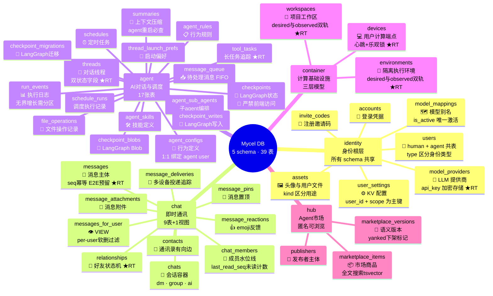
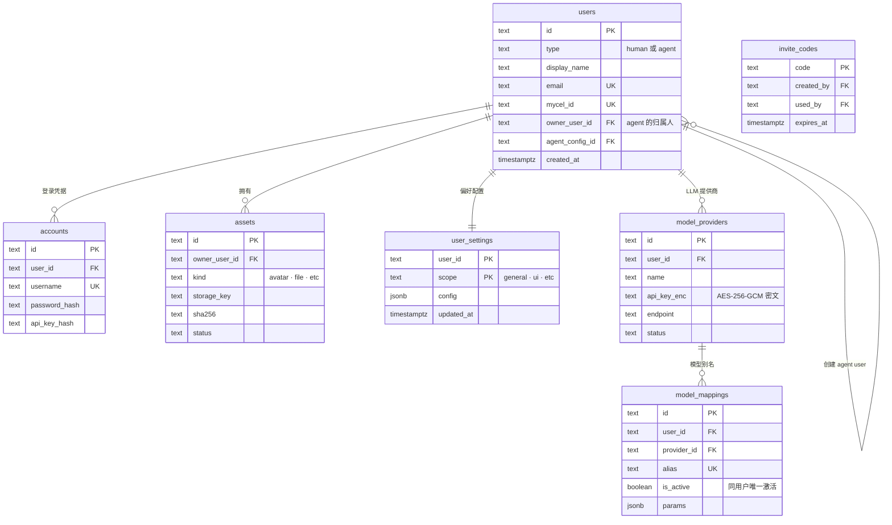
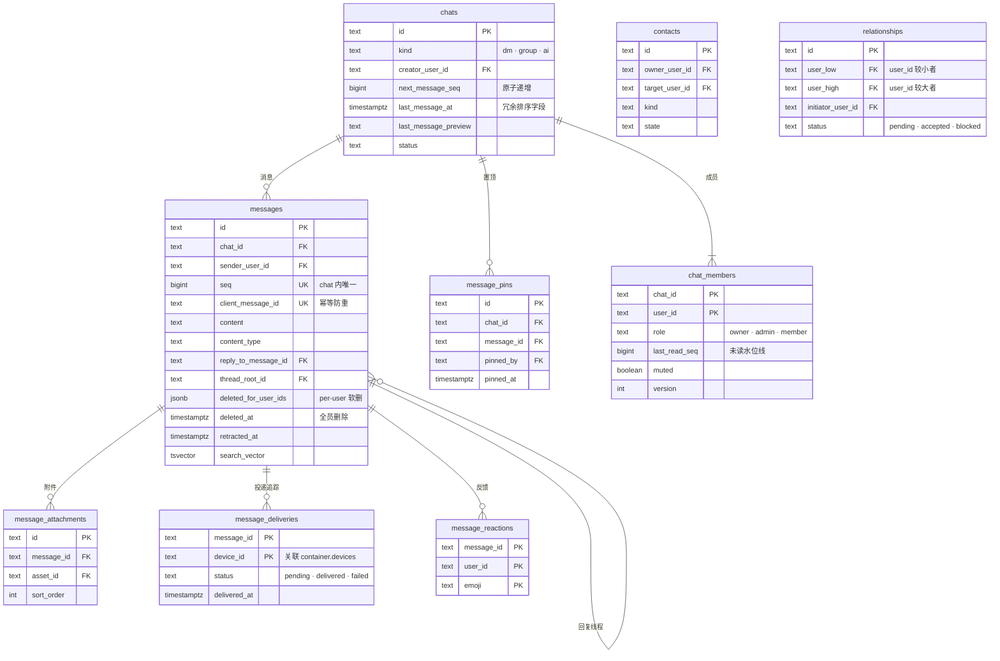
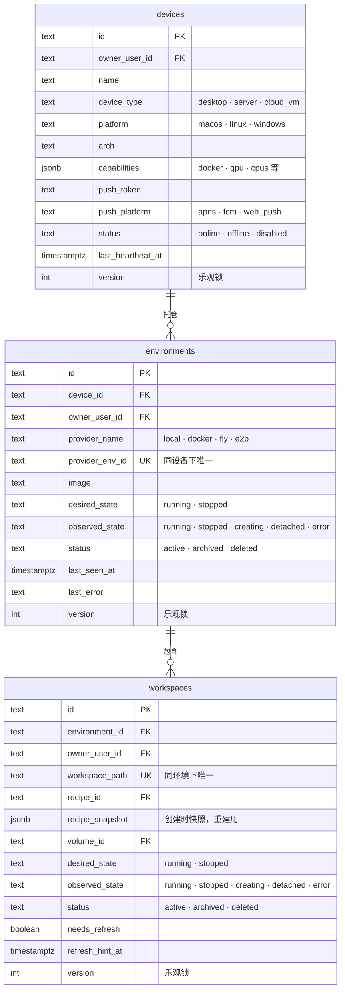

# Mycel DB 全局概览

## 思维导图



> `★RT` = 已加入 Realtime publication · `🔴` = 安全敏感，禁止前端直接访问

---

## 全局设计模式

| 模式 | 用在哪里 | 解决什么问题 |
|------|---------|------------|
| **双轨状态机** `desired_state / observed_state` | container.environments · workspaces | 用户意图（控制面写）与实际状态（daemon 上报）分离，差异驱动收敛 |
| **乐观锁** `version INTEGER` | devices · environments · workspaces · chat_members | 心跳/状态上报高并发时防覆写，CAS 更新，冲突则调用方重试 |
| **软删除** `status = 'deleted'` | 全局 | 数据可恢复；Realtime 触发 UPDATE 事件而非 DELETE，前端拿到完整行再处理 |
| **冗余 `owner_user_id`** | agent · container（跨 schema 查询） | 避免跨表 JOIN，直接按 owner 过滤，也用于 RLS 策略 |
| **应用层 FK（无 DB 外键约束）** | 所有跨 schema 关联 | 避免跨 schema 锁表；允许未来按 schema 拆分数据库 |
| **`SECURITY DEFINER` RPC** | 心跳·状态上报·seq 分配·未读计数 | 绕过 RLS 做原子操作，业务校验在 RPC 内部显式执行 |
| **部分索引** `WHERE status = 'active'` | 全局 | 只索引有效行，减少索引体积，提升扫描效率 |
| **`is_member()` 辅助函数** | chat schema 所有 RLS 策略 | `STABLE` 缓存优化，同一 query 内多次 RLS 判断只查一次 |
| **recipe_snapshot 快照** | container.workspaces | 创建时固化 recipe，recipe 后续变更不影响已有工作区的重建 |
| **水位线未读计数** | chat.chat_members.last_read_seq | O(1) 计算未读数：`next_message_seq - 1 - last_read_seq`，不扫消息表 |

---

## 跨 schema 依赖关系

```
                    ┌─────────────────────────────────┐
                    │           identity               │
                    │  users · accounts · assets       │
                    │  user_settings · invite_codes    │
                    │  model_providers · model_mappings│
                    └──────────────┬──────────────────┘
                                   │ 所有 schema 依赖 identity.users
           ┌───────────────────────┼───────────────────────┐
           ▼                       ▼                       ▼
  ┌────────────────┐    ┌─────────────────┐    ┌──────────────────┐
  │     chat       │    │     agent       │    │    container     │
  │ messages_for_  │    │ threads ──────────────→ workspaces      │
  │ user(VIEW)     │    │ run_events      │    │ environments     │
  │ chat_members   │    │ tool_tasks      │    │ devices ◄────────┤
  │ relationships  │    │ schedules       │    └──────────────────┘
  └───────┬────────┘    └─────────────────┘             │
          │                                              │
          └──── message_deliveries.device_id ────────────┘
                    (push 投递追踪)

  ┌──────────────┐
  │     hub      │  → identity.users（publishers.user_id）
  │  publishers  │  孤立叶节点，无其他 schema 依赖
  │  items       │
  │  versions    │
  └──────────────┘
```

---

## Realtime 发布配置

```sql
-- ★ 必须开启（核心实时体验）
ALTER PUBLICATION supabase_realtime ADD TABLE
    identity.users,           -- chat 列表头像 / 名字实时刷新
    identity.model_providers, -- 设置页：provider 探测失败即时提示
    chat.messages,            -- 新消息实时推送（IM 核心）
    chat.relationships,       -- 好友请求通知
    agent.threads,            -- AI 运行状态 → 前端进度条
    agent.tool_tasks,         -- 长任务进度实时更新
    container.devices,        -- 设备在线 / 离线状态
    container.environments,   -- 环境启动进度
    container.workspaces;     -- 工作区状态 + 重建进度

-- ⚠ 可选（低频，可轮询替代）
-- ALTER PUBLICATION supabase_realtime ADD TABLE
--     chat.chat_members,    -- 成员变更
--     agent.schedules,      -- 定时任务更新
--     hub.marketplace_items;
```

> **⚠️ 安全红线**
> - `agent.checkpoints` 系列（4 张表）**严禁** GRANT 给 authenticated / anon：存有完整对话状态，可能含 API key、文件内容
> - `identity.users` Realtime 广播全体已认证用户，前端订阅**必须加 filter**（如只订阅当前 chat 成员的 ID 集合）
> - `chat.messages` per-user 软删除过滤在应用层，**必须查 `messages_for_user` 视图**，不要直接查 `chat.messages`

---

## 各 Schema ER 图

### identity — 身份根层（7 表）



---

### chat — 即时通讯（9 表 + 1 视图）



---

### agent — AI 对话与调度（17 表）

```mermaid
erDiagram
    agent_configs {
        text id PK
        text agent_user_id FK UK "1:1 绑定 identity.users"
        text owner_user_id FK
        text model "默认模型 alias"
        jsonb tools_json
        text system_prompt
        jsonb mcp_json
    }
    agent_rules { text id PK; text config_id FK }
    agent_skills { text id PK; text config_id FK }
    agent_sub_agents { text id PK; text config_id FK; text sub_agent_user_id FK }

    threads {
        text id PK
        text agent_user_id FK
        text owner_user_id FK
        text current_workspace_id FK "关联 container.workspaces"
        text status "active · archived"
        text run_status "idle · running · paused · error"
        timestamptz last_active_at
        int version
    }
    thread_launch_prefs { text id PK; text thread_id FK; jsonb prefs }

    run_events {
        text id PK
        text thread_id FK
        text type
        jsonb data
        timestamptz created_at "无界增长，建议按月分区"
    }
    summaries {
        text id PK
        text thread_id FK
        text content
        boolean is_active "当前有效摘要"
        int token_count
    }
    message_queue {
        text id PK
        text thread_id FK
        text role
        text content
        timestamptz created_at "id ASC 顺序消费"
    }
    file_operations { text id PK; text thread_id FK; text operation; text path }
    tool_tasks {
        text id PK
        text thread_id FK
        text tool_name
        text status
        jsonb progress
        jsonb result
    }

    schedules {
        text id PK
        text owner_user_id FK
        text agent_user_id FK
        text cron_expr
        boolean enabled
        timestamptz next_run_at
    }
    schedule_runs { text id PK; text schedule_id FK; text status; timestamptz ran_at }

    checkpoints {
        text thread_id PK "LangGraph checkpoint_id"
        text checkpoint_id PK
        jsonb metadata
    }
    checkpoint_blobs { text thread_id PK; text checkpoint_id PK; text channel PK }
    checkpoint_writes { text thread_id PK; text checkpoint_id PK; int idx PK }
    checkpoint_migrations { int v PK }

    agent_configs ||--o{ agent_rules : ""
    agent_configs ||--o{ agent_skills : ""
    agent_configs ||--o{ agent_sub_agents : ""
    threads ||--o{ run_events : "执行日志"
    threads ||--o{ summaries : "上下文压缩"
    threads ||--o{ message_queue : "待处理消息"
    threads ||--o{ file_operations : ""
    threads ||--o{ tool_tasks : "长任务"
    threads ||--o{ checkpoints : "LangGraph 状态"
    schedules ||--o{ schedule_runs : "执行记录"
```

---

### container — 计算基础设施（3 表）



---

### hub — Agent 市场（3 表）

```mermaid
erDiagram
    publishers {
        text id PK
        text user_id FK UK "1:1 绑定 identity.users"
        text display_name
        text status "active · suspended"
        timestamptz created_at
    }
    marketplace_items {
        text id PK
        text publisher_id FK
        text name
        text slug UK
        text visibility "public · unlisted · private"
        int install_count
        jsonb tags
        tsvector search_vector "GIN 索引全文搜索"
        timestamptz published_at
    }
    marketplace_versions {
        text id PK
        text item_id FK
        text version "语义版本 semver"
        text published_by FK
        boolean yanked "true = 已下架"
        jsonb manifest
        timestamptz created_at
    }

    publishers ||--o{ marketplace_items : "发布"
    marketplace_items ||--o{ marketplace_versions : "版本历史"
```

---

## 5 个核心 RPC 概览

| RPC | 所属 schema | 功能 |
|-----|-----------|------|
| `device_heartbeat(device_id, version, capabilities?)` | container | 心跳 + CAS 更新，含 10s 节流防 DDoS |
| `device_disconnect(device_id)` | container | 原子级联：设备→offline，环境→detached，工作区→detached |
| `environment_observe / workspace_observe` | container | daemon 上报实际状态，返回 desired_state 作指令 |
| `count_unread_per_chat()` | chat | 基于水位线批量计算未读数，user_id 从 auth.uid() 取 |
| `mark_read(chat_id, seq)` | chat | 更新 last_read_seq 水位线，只前进不后退 |
