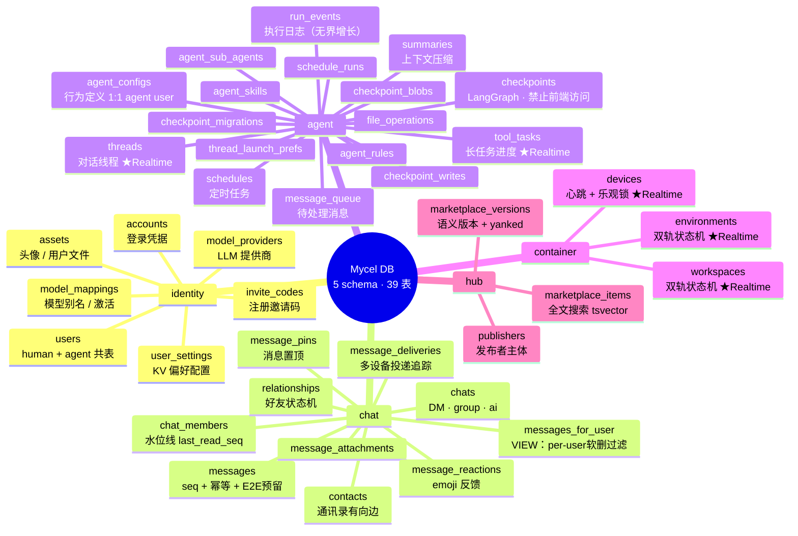

# Mycel DB 全局概览



---

## 跨 schema 依赖

```
identity ←── chat      (sender_user_id, contacts, relationships)
identity ←── agent     (agent_user_id, owner_user_id, model解析)
identity ←── container (owner_user_id 冗余)
identity ←── hub       (publishers.user_id)
container ←── chat     (message_deliveries.device_id → devices)
container ←── agent    (threads.current_workspace_id → workspaces)
```

> identity 是纯根层，零外向依赖。hub 是最孤立叶节点。

---

## 关键设计模式

| 模式 | 用在哪里 | 解决什么 |
|------|---------|---------|
| 双轨状态机 `desired/observed` | container.environments · workspaces | 控制面意图 vs 实际状态分离 |
| 乐观锁 `version` | devices · environments · workspaces · chat_members | 并发写入冲突 |
| 软删除 `status='deleted'` | 全局 | 可恢复 + Realtime UPDATE 事件 |
| 应用层 FK | 所有跨 schema 关联 | 避免跨 schema 锁表 |
| `SECURITY DEFINER` RPC | 心跳·状态上报·seq分配·未读计数 | 绕过 RLS 做原子操作 |
| 部分索引 `WHERE status='active'` | 全局 | 减少索引体积，只扫有效行 |

---

## Realtime 发布（必须开启）

```sql
ALTER PUBLICATION supabase_realtime ADD TABLE
    identity.users,
    identity.model_providers,
    chat.messages,
    chat.relationships,
    agent.threads,
    agent.tool_tasks,
    container.devices,
    container.environments,
    container.workspaces;
```

> ⚠️ `agent.checkpoints` 系列严禁 GRANT 给前端，存有完整对话状态。
> ⚠️ `identity.users` Realtime 广播全体，前端订阅必须加 filter。
